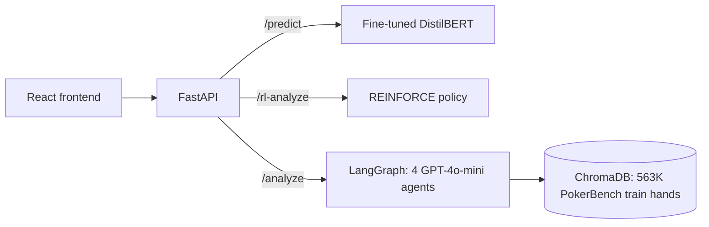

# poker-multi-agent

Predicting solver-optimal poker actions with a fine-tuned DistilBERT, compared against an LLM agent pipeline, plus a small policy-gradient agent.

I fine-tuned DistilBERT (66M parameters) on PokerBench, a dataset of 6-player No Limit Hold'em hands labeled with the action a poker solver chose. It gets 74.4% accuracy on the 11,000-hand test set. On a 300-hand sample of that test set, it scored 76.0% against 46.7% for a GPT-4o-mini agent pipeline I built earlier, with a median latency of 53 ms against 5.5 s.

Most of the sections below are about what went wrong along the way and how I tracked it down.

## Results

| Model | Evaluation | Result |
|---|---|---|
| Majority class baseline | 11,000 test hands | 25.0% |
| DistilBERT v1 (first 50K rows) | 11,000 test hands | 67.28% |
| **DistilBERT v2 (shuffled 50K sample)** | **11,000 test hands** | **74.39%** |
| DistilBERT v2 | 300 stratified test hands | 76.0%, 53 ms median latency |
| LLM agent pipeline (GPT-4o-mini) | same 300 hands | 46.7%, 5.5 s median latency |
| REINFORCE agent, structured features | 3 seeds, synthetic environment | 0.795 mean reward (max about 0.81) |

## Architecture



- `/predict` runs the fine-tuned DistilBERT. It returns the predicted action, the probability of each action, and an `in_distribution` flag that is false when the input doesn't look like a PokerBench prompt.
- `/analyze` runs the LLM pipeline. Four agents (hand analysis, opponent modeling, strategy, explanation) pull similar hands from ChromaDB and stream a written explanation to the frontend.
- `/rl-analyze` runs the policy-gradient agent from the synthetic environment described below.

## Data

[PokerBench](https://huggingface.co/datasets/RZ412/PokerBench) has 563,200 training hands and 11,000 test hands. Each hand is a long text prompt (positions, cards, full action history, pot size) with the solver's action as the label. I reduced the labels to five actions (fold, call, check, raise, bet) by dropping bet sizes.

## DistilBERT

Fine-tuned `distilbert-base-uncased` for 5-class classification: 50K training hands, 80/20 train/validation split, 5 epochs, AdamW at 2e-5 with linear warmup, class-weighted cross entropy, 256-token inputs. Trained on an M-series MacBook (MPS), with runs tracked in Weights & Biases.

### The sampling bug

v1 scored 74.8% on validation but only 67.3% on the test set. Splitting test accuracy by street showed where the gap came from:

| Street | v1 | v2 |
|---|---|---|
| Preflop | 8.5% | **84.8%** |
| Flop | 74.2% | 73.2% |
| Turn | 76.4% | 76.1% |
| River | 70.5% | 71.2% |

v1 scored 8.5% on preflop hands, worse than random guessing. PokerBench is stored in blocks, and I had trained on the first 50K rows, which contained no preflop hands at all.

For v2 I took a seeded shuffle of the full training split (11.2% preflop, same as the whole dataset) and retrained from the same pretrained weights with the same settings. Test accuracy went from 67.3% to 74.4%, and all of the gain came from preflop. Postflop accuracy stayed around 73% even though v2 trained on roughly 11% fewer postflop hands. Validation (74.8%) and test (74.4%) are now within half a point of each other, so the validation number is a reasonable estimate again.

### Per-class results (v2)

| Action | Precision | Recall | F1 |
|---|---|---|---|
| Fold | 0.776 | 0.834 | 0.804 |
| Call | 0.769 | 0.663 | 0.712 |
| Check | 0.825 | 0.835 | 0.830 |
| Raise | 0.623 | 0.708 | 0.663 |
| Bet | 0.587 | 0.521 | 0.552 |

Bet is the weakest class, and also the rarest label (950 of 11,000 test hands). v1 was worse on it, with bet precision of 0.35.

### Truncation check

River was the weakest street, and 62% of test hands go past the 256-token limit (98.8% of river hands). I looked at what gets cut off on the longest hand in the test set. It's the closing instruction, which is the same in every prompt, plus a repeat of the hole cards that are already listed earlier. The pot size and the full action history are kept. Truncation doesn't explain the lower river accuracy, so I didn't retrain for it.

## LLM baseline

Both systems ran on the same 300 test hands, stratified by street (27 preflop, 17 flop, 112 turn, 144 river), seed 42.

| | DistilBERT v2 | LLM pipeline |
|---|---|---|
| Overall | **76.0%** | 46.7% |
| Preflop | 88.9% | 59.3% |
| Flop | 70.6% | 52.9% |
| Turn | 76.8% | 50.0% |
| River | 73.6% | 41.0% |
| Median latency | 53 ms (CPU, one hand at a time) | 5.5 s |
| Cost | local CPU | about $0.09 for all 300 hands |

Every LLM answer contained a valid action, so none of its misses come from formatting problems. ChromaDB only holds the training split, so the pipeline can't retrieve answers to test hands.

One caveat: the pipeline was built to explain hands to a player, and I didn't tune it for this benchmark. A prompt written specifically for predicting solver actions might score higher. With 300 hands, each accuracy number has a margin of error of about 5 points, so the 29-point gap isn't a sampling fluke.

## RL agent

This part uses a synthetic environment instead of PokerBench. A state is a hand strength bucket (5 levels), a position (6), and a stack depth (3). The agent picks one action and gets an immediate reward from a reward table I wrote from basic poker principles. Since there's only one decision per episode, this is a contextual bandit problem rather than a full game.

Training uses REINFORCE with a moving-average baseline, a small entropy bonus (0.001), learning rate 5e-4, batch size 32, and 3,000 episodes. A frozen earlier copy of the policy gets logged for comparison, but it has no effect on training.

The first version fed each state to the policy as text through the fine-tuned DistilBERT. It was inconsistent. Most runs plateaued around 0.65 by checking in spots where folding or calling paid more, and only some runs got past that. The embeddings barely separated hand strengths: cosine similarity between "weak hand" and "strong hand" was 0.988. I added the state as 14 one-hot features. That alone didn't fix it, but removing the embedding did:

| Policy input | Seed 0 | Seed 1 | Seed 2 | Mean |
|---|---|---|---|---|
| DistilBERT embedding + features | 0.652 | 0.756 | 0.646 | 0.685 |
| **Features only** | **0.789** | **0.813** | **0.782** | **0.795** |

The best possible average reward under this reward table is about 0.81. My guess is that the 768 embedding dimensions drowned out the 14 useful ones, so the policy committed to an action before it learned much, and REINFORCE is slow to move away from a policy that's already nearly deterministic. The served model is the features-only seed 1 policy.

## Running it

Python 3.13.

```bash
python -m venv venv
source venv/bin/activate
pip install -r requirements.txt
echo "OPENAI_API_KEY=your_key" > .env
```

The fine-tuned model is on the Hugging Face Hub. To use it without training locally:

```bash
export DISTILBERT_PATH=jinha1491/poker-distilbert
```

Loading PokerBench into ChromaDB is only needed for `/analyze`. It takes a long time and several GB of disk:

```bash
python src/data/load_data.py
```

Start the API and frontend:

```bash
uvicorn src.api.main:app --port 8000
cd frontend && npm install && npm start
```

Example request:

```bash
curl -X POST http://localhost:8000/rl-analyze \
  -H "Content-Type: application/json" \
  -d '{"hand_situation": "You are in the BTN position with deep stacks. You have a premium hand."}'
```

### Reproducing the results

```bash
python -m src.models.finetune_v2                                                # train v2
MODEL_PATH=src/models/poker_distilbert_v2 TAG=v2 python -m src.models.evaluate  # test set metrics
MODEL_PATH=src/models/poker_distilbert_v2 python -m src.models.diagnose_streets # per-street accuracy
python -m src.models.compare_baseline                                           # LLM comparison
for s in 0 1 2; do python -m src.rl.train_rl --seed $s --no-embedding; done     # RL, 3 seeds
```

## Limitations

- Trained on 50K of the 563K available hands. More data would probably help, but training takes much longer on a laptop.
- PokerBench gives one label per hand, while solvers often mix between actions in close spots. Some of the "errors" are reasonable plays, so the real accuracy ceiling is below 100%.
- The RL environment is synthetic. It uses five hand strength buckets instead of real cards, and a reward table I designed rather than computed expected value.
- The LLM baseline is my own agent pipeline, not a prompt tuned for this benchmark.
- The "GTO frequency" numbers in the `/analyze` output are written by GPT-4o-mini. No solver computes them.

## Links

- Model: [jinha1491/poker-distilbert](https://huggingface.co/jinha1491/poker-distilbert) (tags `v1` and `v2`)
- Dataset: [RZ412/PokerBench](https://huggingface.co/datasets/RZ412/PokerBench)
